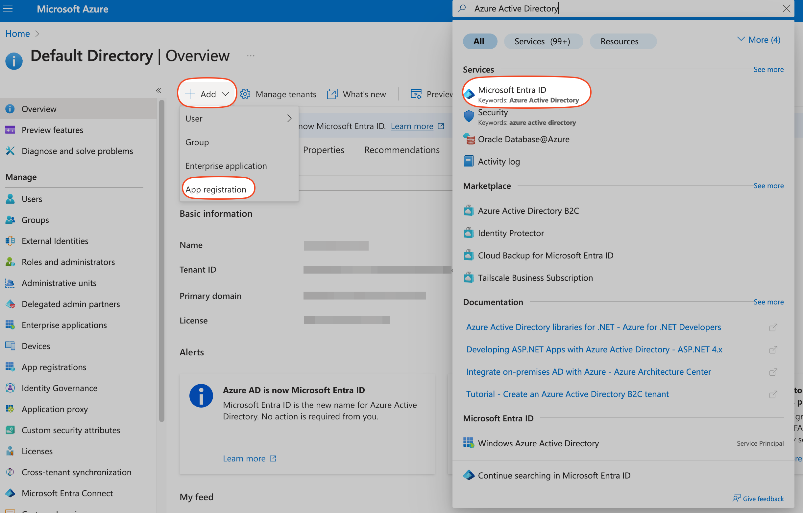
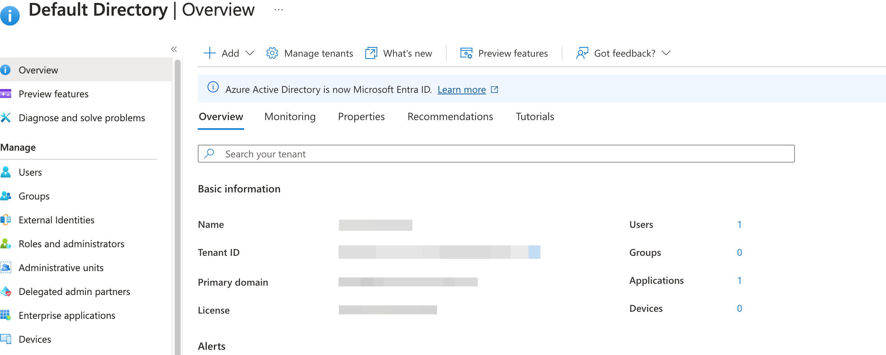
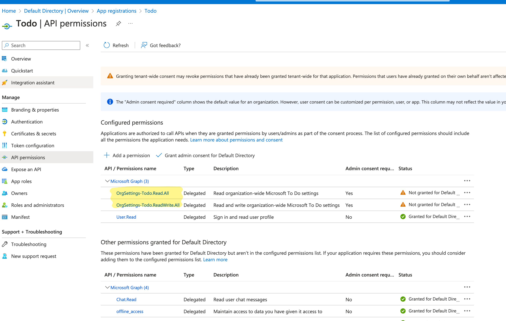

# Microsoft To-Do

## Status

暂时不想做

## Setup

> Starting November 9th, 2020 end users will no longer be able to grant consent to newly registered multitenant apps without verified publishers

并且 ToDo 的数据还算是敏感, 所以目前还是需要自己去 Azure 注册一个应用, 然后使用 `Application (client) ID` 和 `Directory (tenant) ID` 走 [PKCE flow](https://datatracker.ietf.org/doc/html/rfc7636) 获取 token.[^1]

### Setup Azure

参看 [microsoft-teams](https://www.raycast.com/sven/microsoft-teams)

1. Open the Azure Portal
2. Navigate to Azure Active Directory
3. Navigate to App registrations
4. Click + New registration in the toolbar

回调地址可以是:

- `https://raycast.com/redirect?packageName=Extension`
- `https://raycast.com/redirect/extension`

需要注意的 Azure 虽然支持 customScheme, 但是不支持 query 参数, 所以最好的 `raycast://oauth?package_name=Extension` 无法使用.

#### 权限设置

进入 Application 然后把 Todo 相关的权限都给加上.

## Dev

### Common To Do API operations

| Operation| Request|
| ---| ---|
| List all the task lists | GET `https://graph.microsoft.com/v1.0/me/todo/lists`|
|List all tasks in a task list| GET `https://graph.microsoft.com/v1.0/me/todo/lists/{todoTaskListId}/tasks`|
|Create a new task|POST `https://graph.microsoft.com/v1.0/me/todo/lists/{todoTaskListId}/tasks`|
|Update a task | PATCH `https://graph.microsoft.com/v1.0/me/todo/lists/{todoTaskListId}/tasks/{todoTaskId}`|
|Delete a task| DELETE `https://graph.microsoft.com/v1.0/me/todo/lists/{todoTaskListId}/tasks/{todoTaskId}`|

### Doc

- [Microsoft Graph client library for JavaScript](https://github.com/microsoftgraph/msgraph-sdk-javascript)
- [To Do API overview
](https://learn.microsoft.com/en-us/graph/todo-concept-overview)
- [To Do API in Microsoft Graph v1.0](https://learn.microsoft.com/en-us/graph/api/resources/todo-overview?view=graph-rest-1.0&preserve-view=true)
- [To-do website](https://to-do.office.com/tasks/)

[^1]: <https://developers.raycast.com/api-reference/oauth#oauth-flow>
